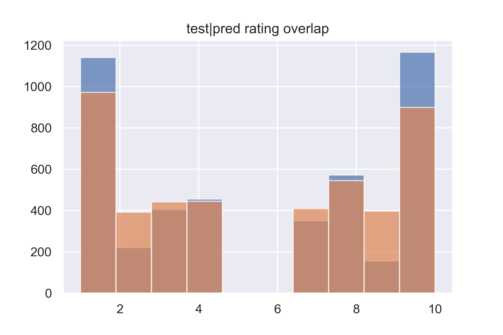

# lightEnoughHerokuApp

This is a lightweight Django app written in Python 3.7.4. It can rate a movie review written in English. 
It was trained using the dataset [1], tensorflow==2.1.0, scikit-learn==0.23.2.

requirements:

django
gunicorn
django-heroku
numpy
joblib
djangorestframework
sklearn

run:
cd movies
python manager.py runserver

or visit :

https://polar-island-26100.herokuapp.com

Example:

https://polar-island-26100.herokuapp.com/rater/?text=high%20rating%20is%20deserved

[1] Andrew L. Maas, Raymond E. Daly, Peter T. Pham, Dan Huang, Andrew Y. Ng, and Christopher Potts. (2011). Learning Word Vectors for Sentiment Analysis. The 49th Annual Meeting of the Association for Computational Linguistics (ACL 2011).